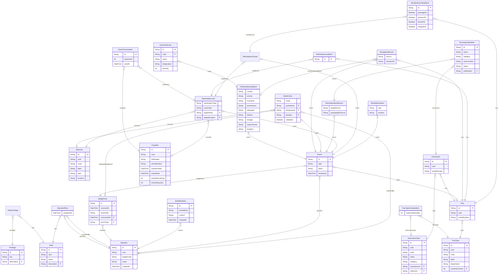

```mermaid
erDiagram

  "Operator" {
    String id "🗝️"
    String uuid 
    String badgeCode 
    String name 
    DateTime createdAt 
    }
  

  "Role" {
    String id "🗝️"
    String uuid 
    String name 
    String description "❓"
    }
  

  "Privilege" {
    String id "🗝️"
    String key 
    String description "❓"
    }
  

  "RolePrivilege" {

    }
  

  "OperatorRole" {
    DateTime assignedAt 
    }
  

  "BadgeScan" {
    String id "🗝️"
    DateTime scannedAt 
    String terminalId 
    DateTime consumedAt "❓"
    String eventType "❓"
    }
  

  "WorkflowNote" {
    String id "🗝️"
    String moduleKey 
    String content 
    DateTime createdAt 
    }
  

  "TrayType" {
    String id "🗝️"
    String uuid 
    String code 
    String label 
    String department 
    Int maxInstruments "❓"
    }
  

  "InstrumentType" {
    String id "🗝️"
    String uuid 
    String code 
    String name 
    String category 
    String manufacturer "❓"
    String reference "❓"
    }
  

  "TrayTypeComposition" {
    Int expectedQuantity 
    }
  

  "Machine" {
    String id "🗝️"
    String uuid 
    String code 
    String label 
    String type 
    String location 
    }
  

  "Tray" {
    String id "🗝️"
    String uuid 
    String serialNumber 
    }
  

  "Instrument" {
    String id "🗝️"
    String uuid 
    String serialNumber 
    }
  

  "Cassette" {
    String id "🗝️"
    String uuid 
    String lotNumber 
    String serialNumber 
    DateTime insertionDate 
    DateTime expiryDate 
    Int dosesRemaining 
    Int dosesRequired 
    }
  

  "DoseConsumption" {
    String id "🗝️"
    Int doseUsed 
    DateTime usedAt 
    }
  

  "Event" {
    String id "🗝️"
    String type 
    String place 
    DateTime timestamp 
    }
  

  "PreDesinfectionBatch" {
    String cycleId 
    String priority 
    String boxName 
    String provenance 
    String detergent 
    String dilution 
    String dosage 
    String waterVolume 
    String duration 
    }
  

  "InstrumentLine" {
    String id "🗝️"
    String code "❓"
    String name 
    String designation 
    Int quantity 
    }
  

  "ReceptionRecord" {
    String source 
    String transportId 
    }
  

  "WashCycle" {
    String mode 
    String cycleName "❓"
    String temperature "❓"
    String duration "❓"
    Boolean validated 
    }
  

  "RecompositionRecord" {
    String targetDevice 
    String packagingProtocol 
    }
  

  "RecompositionItem" {
    String id "🗝️"
    String name 
    String category 
    String rackLocation 
    String status 
    String justification "❓"
    }
  

  "SterilizationLoad" {
    String sterilizationType 
    String cycleType 
    String targetTemp "❓"
    String targetDuration "❓"
    }
  

  "SterilizationLoadItem" {
    String id "🗝️"
    }
  

  "SterilizationUnload" {

    }
  

  "SterilizationUnloadItem" {
    String id "🗝️"
    Boolean passageOk 
    Boolean physicoOk 
    Boolean sicciteOk 
    Boolean integriteOk 
    }
  

  "SterileMovement" {
    String type 
    String location 
    }
  
    "RolePrivilege" }o--|| "Role" : "role"
    "RolePrivilege" }o--|| "Privilege" : "privilege"
    "OperatorRole" }o--|| "Operator" : "operator"
    "OperatorRole" }o--|| "Role" : "role"
    "OperatorRole" }o--|| "Operator" : "assignedBy"
    "BadgeScan" }o--|| "Operator" : "operator"
    "WorkflowNote" }o--|| "Operator" : "author"
    "TrayTypeComposition" }o--|| "TrayType" : "trayType"
    "TrayTypeComposition" }o--|| "InstrumentType" : "instrumentType"
    "Tray" }o--|| "TrayType" : "type"
    "Instrument" }o--|| "InstrumentType" : "type"
    "Instrument" }o--|| "Tray" : "tray"
    "DoseConsumption" }o--|| "Cassette" : "cassette"
    "DoseConsumption" }o--|| "SterilizationLoad" : "loadEvent"
    "Event" }o--|| "Operator" : "operator"
    "Event" |o--|| "BadgeScan" : "badgeScan"
    "Event" }o--|o "Tray" : "boite"
    "PreDesinfectionBatch" |o--|| "Event" : "event"
    "InstrumentLine" }o--|| "PreDesinfectionBatch" : "batch"
    "ReceptionRecord" |o--|| "Event" : "event"
    "ReceptionRecord" }o--|| "Tray" : "tray"
    "ReceptionRecord" }o--|o "PreDesinfectionBatch" : "preDisinfectionBatch"
    "WashCycle" |o--|| "Event" : "event"
    "WashCycle" }o--|| "Machine" : "machine"
    "WashCycle" }o--|o "Operator" : "validatedBy"
    "WashCycle" |o--|o "BadgeScan" : "validatedBadgeScan"
    "RecompositionRecord" |o--|| "Event" : "event"
    "RecompositionItem" }o--|| "Instrument" : "instrument"
    "RecompositionItem" }o--|| "RecompositionRecord" : "record"
    "SterilizationLoad" |o--|| "Event" : "event"
    "SterilizationLoad" }o--|| "Machine" : "machine"
    "SterilizationLoad" }o--|o "Cassette" : "cassette"
    "SterilizationLoadItem" }o--|| "Tray" : "tray"
    "SterilizationLoadItem" }o--|| "SterilizationLoad" : "loadEvent"
    "SterilizationUnload" |o--|| "Event" : "event"
    "SterilizationUnload" }o--|| "SterilizationLoad" : "loadEvent"
    "SterilizationUnloadItem" }o--|| "Tray" : "tray"
    "SterilizationUnloadItem" }o--|| "SterilizationUnload" : "unloadEvent"
    "SterileMovement" |o--|| "Event" : "event"
```
